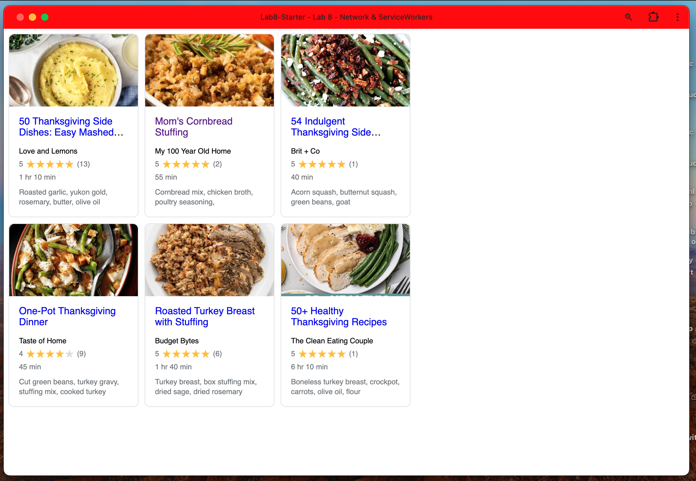

# Lab 8
## Names: Salman Navroz, Maxim Podgore

## Github Pages [URL](https://maximpodgore.github.io/Lab8-Starter/): 

## **How are graceful degradation and service workers related?**
Graceful degradation allows the application to function to a certain degree even when things go wrong. Service workers can check and store network responses from network requests, so if you happen to be offline it can check if you already have the data locally, so you can still use it offline. In other words, service workers will make it easier for graceful degredation to happen because it will handle the apps requests when it's online, store the neccessary data it needs to, so it can function if the internet is bad or there is some other faults in the network or app.

## pwa.png

